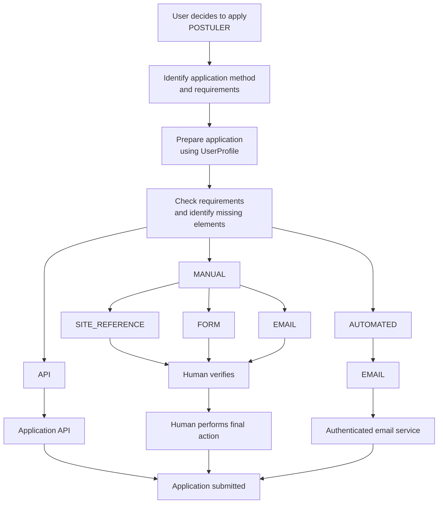
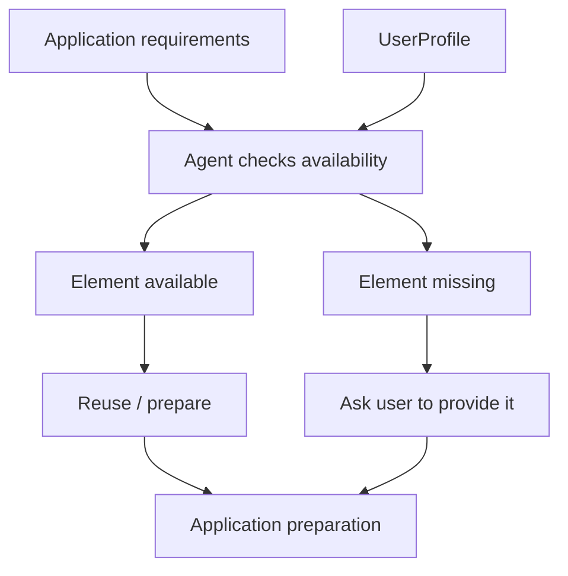
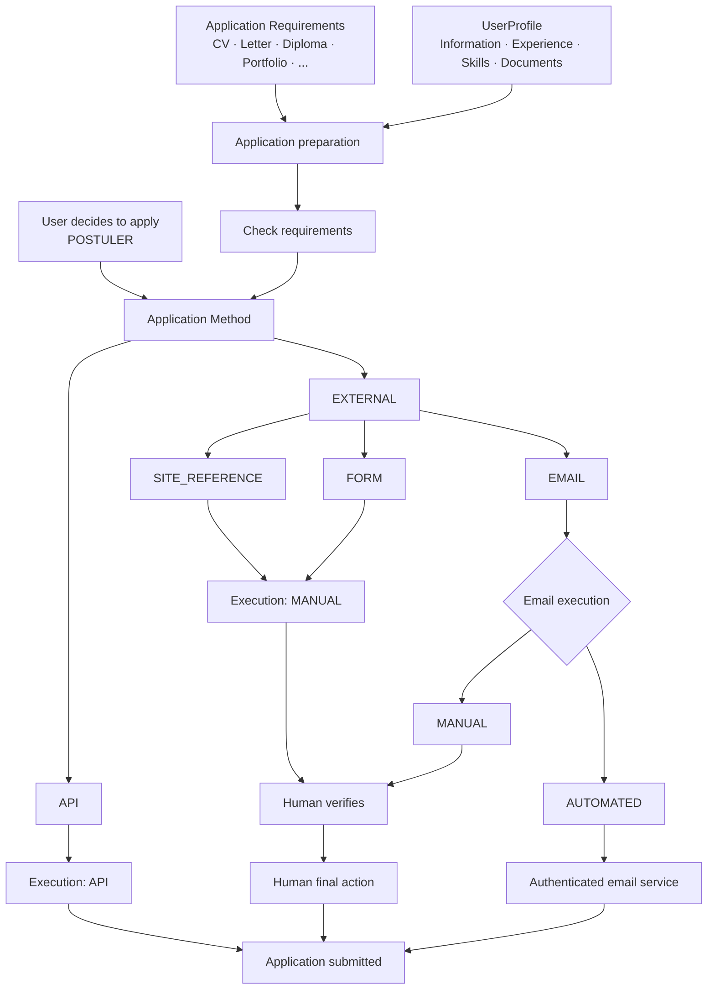

# Application Workflow

> Source of truth for **Part 2 of the Job Search Agent**: the workflow that starts when the user decides to apply and ends when the application is submitted or the final human action is completed.

## 1. Scope

This document describes **exclusively the application workflow**.

### Start

The workflow starts when the user explicitly decides to apply to a job offer:

**`POSTULER`**

### End

The workflow ends when the application has been submitted through the available mechanism, or when the final human action has been completed for a manual workflow.

### Outside this document

The following belong to Part 1 and are not described here:

- job source discovery;
- job collection;
- parsing and normalization;
- deduplication;
- filtering;
- matching;
- explanation;
- recommendation;
- the decision process leading to `POSTULER`.

Boundary:

```text
Part 1
Search → Collect → Normalize → Deduplicate → Filter → Match → Explain → Recommend
                                                        ↓
                                                USER DECIDES
                                                 "POSTULER"
                                                        ↓
Part 2
Application Workflow
```

---

## 2. Core principle

The workflow separates three concepts:

1. **Application Method** — how the application is transmitted.
2. **Execution Mode** — how the submission is actually carried out.
3. **Application Requirements** — what information/documents are required.

These concepts must not be conflated.

---

## 3. Global workflow



---

## 4. Application Method

`ApplicationMethod` describes **the channel through which the candidate applies**.

```text
ApplicationMethod
│
├── API
│
└── EXTERNAL
    │
    ├── SITE_REFERENCE
    ├── FORM
    └── EMAIL
```

### 4.1 API

The source exposes an application API that can be used as the application channel.

```text
Agent
  ↓
Application API
  ↓
Application submitted
```

The existence of an application API is a useful modeling distinction.

**Important:** the existence of an API does not, by itself, establish that the project has the required credentials, authorization, or permission to use it. Those are implementation/access questions handled separately.

### 4.2 EXTERNAL

`EXTERNAL` means that the application is handled through an external channel rather than through an application API integrated into the agent.

It currently contains:

```text
EXTERNAL
├── SITE_REFERENCE
├── FORM
└── EMAIL
```

#### SITE_REFERENCE

The offer provides a reference/link to an external site or application page.

```text
Agent prepares
      ↓
User opens external site
      ↓
User verifies
      ↓
User performs final submission
```

#### FORM

The application is performed through an external form.

```text
Agent prepares information
      ↓
External form
      ↓
User verifies
      ↓
User clicks "Submit/Send"
```

The agent may prepare the information required by the form, but in the current model the final submission remains human-controlled.

#### EMAIL

The application is made through an email address.

There are two execution possibilities:

```text
EMAIL
├── MANUAL
└── AUTOMATED
```

**Manual email**

```text
Agent prepares:
- recipient
- subject
- message
- attachments

        ↓

User verifies

        ↓

User clicks "Send"
```

**Automated email**

If the application has an authenticated and authorized email service/integration:

```text
Agent prepares
      ↓
Authenticated email service
      ↓
Email sent
```

The user does not necessarily need to perform the final send action in this case.

---

## 5. Execution Mode

`ExecutionMode` describes **how the application is actually submitted**.

```text
ExecutionMode
│
├── API
├── MANUAL
└── AUTOMATED
```

### 5.1 API

```text
Agent → Application API → Submitted
```

### 5.2 MANUAL

`MANUAL` means:

> The agent can prepare the application, but a human must perform the final action.

This includes:

```text
MANUAL
│
├── SITE_REFERENCE
├── FORM
└── EMAIL
```

The agent can still do substantial preparation:

```text
Agent
 ├── retrieves profile information
 ├── prepares answers
 ├── selects documents
 └── prepares application content
          ↓
       Human
          ↓
      verifies
          ↓
    final action
```

Therefore:

**MANUAL does not mean that the whole process is manual.**

It means that the **final submission action remains human-controlled**.

### 5.3 AUTOMATED

`AUTOMATED` means that the application can be submitted without the user performing the final send action, through an authorized technical mechanism.

At the current modeling stage, the identified case is:

```text
AUTOMATED
└── EMAIL
```

```text
Agent
  ↓
Prepare email
  ↓
Authenticated email service
  ↓
Send
```

---

## 6. Application Requirements

Application requirements are **not application methods**.

They describe what the application requires from the candidate.

```text
ApplicationRequirements
│
├── CV
├── Cover Letter
├── Diploma
├── Portfolio
└── Other File
```

Examples:

```text
FORM
+
CV required
+
Cover Letter required
```

```text
EMAIL
+
CV required
```

```text
SITE_REFERENCE
+
CV required
+
Portfolio required
```

A file upload is therefore generally an **application requirement**, not a separate application method.

---

## 7. UserProfile as the source for application preparation

The `UserProfile` provides the information and documents that the agent can reuse:

```text
USER PROFILE
│
├── Personal information
├── Contact information
├── Education
├── Experience
├── Skills
├── Languages
├── Certifications
├── Projects
│
└── Documents
    ├── CV
    ├── Cover Letter
    ├── Diplomas
    ├── Portfolio
    └── Other documents
```

The application workflow uses this profile rather than asking the user to repeatedly provide information already available.

---

## 8. Requirement checking

The agent compares the requirements of the offer with what is available in `UserProfile`.



If a required information/document exists, the agent reuses/prepares it.

If it is missing:

```text
Requirement
    ↓
Not available
    ↓
Agent asks user
    ↓
User provides it
    ↓
Agent continues preparation
```

---

## 9. File handling

A file is not automatically an application method.

The agent first looks for the required document in the user's profile.

### Document already available

```text
Application requires CV
        ↓
CV exists in UserProfile
        ↓
Agent uses CV
```

### Document not available

```text
Application requires diploma
        ↓
Diploma not in UserProfile
        ↓
Agent asks user
        ↓
User provides diploma
        ↓
Agent continues
```

The system therefore does not need unrestricted access to the user's machine simply because an external application contains a file-upload field.

A file can be supplied explicitly by the user when it is not already available in the application profile.

---

## 10. Human-in-the-loop

For manual applications:

```text
Agent prepares
     ↓
Human verifies
     ↓
Human performs final action
```

This applies to:

- external site applications;
- external forms;
- manually sent emails.

The purpose is to keep the final action under user control.

---

## 11. Complete scenarios

### Scenario A — API

```text
User clicks POSTULER
        ↓
Identify API application method
        ↓
Check requirements
        ↓
Use UserProfile
        ↓
Prepare application
        ↓
Application API
        ↓
Application submitted
```

### Scenario B — External site

```text
User clicks POSTULER
        ↓
SITE_REFERENCE
        ↓
Prepare information/documents
        ↓
User opens external site
        ↓
User verifies
        ↓
User submits
```

### Scenario C — External form

```text
User clicks POSTULER
        ↓
FORM
        ↓
Prepare answers/documents
        ↓
User verifies
        ↓
User submits form
```

### Scenario D — Manual email

```text
User clicks POSTULER
        ↓
EMAIL
        ↓
Prepare recipient
Prepare subject
Prepare message
Prepare attachments
        ↓
User verifies
        ↓
User clicks Send
```

### Scenario E — Automated email

```text
User clicks POSTULER
        ↓
EMAIL
        ↓
Prepare recipient
Prepare subject
Prepare message
Prepare attachments
        ↓
Authenticated email service
        ↓
Email sent
```

---

## 12. Important modeling distinctions

### Application method

**How do we apply?**

```text
API
SITE_REFERENCE
FORM
EMAIL
```

### Execution mode

**Who/what performs the final submission?**

```text
API
MANUAL
AUTOMATED
```

### Application requirements

**What must be provided?**

```text
CV
Cover Letter
Diploma
Portfolio
...
```

These three concepts should not be merged into one enumeration.

---

## 13. Current boundary with future capabilities

Browser automation is intentionally **not part of the current application model**.

A future capability could potentially allow an agent to interact with an external browser interface, but this would be a separate technical capability and would require its own authorization, security, anti-bot, authentication, and terms-of-use analysis.

It should therefore not be introduced into the current model simply because a form or external website exists.

Current model:

```text
API
MANUAL
AUTOMATED_EMAIL
```

Future browser automation, if ever supported and authorized, can be modeled separately.

---

## 14. Final conceptual model



---

## 15. Design rules to preserve

> **The application workflow starts only when the user explicitly decides to apply.**

> **The agent prepares the application using the UserProfile and the requirements of the offer.**

> **The final execution depends on the available application mechanism: API, manual human validation, or an authorized automated email flow.**

> **Documents are requirements, not application methods.**

> **The current model does not include browser automation.**

This document is intentionally limited to **Part 2 — Application Workflow** and remains independent from source research, connector implementation, and job matching workflows.
